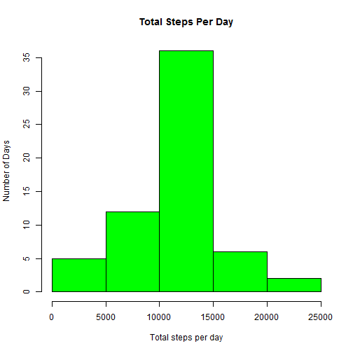

Loading and preprocessing the data
=======================================


```r
library(knitr)
mydata<-read.csv("activity.csv",head=TRUE,sep=",")
nrow(mydata)
```

```
## [1] 17568
```

```r
str(mydata)
```

```
## 'data.frame':	17568 obs. of  3 variables:
##  $ steps   : int  NA NA NA NA NA NA NA NA NA NA ...
##  $ date    : Factor w/ 61 levels "2012-10-01","2012-10-02",..: 1 1 1 1 1 1 1 1 1 1 ...
##  $ interval: int  0 5 10 15 20 25 30 35 40 45 ...
```

```r
data<-na.omit(mydata)
nrow(data)
```

```
## [1] 15264
```

What is mean total number of steps taken per day?
==================================================

```r
library(dplyr)
activity<-data %>% group_by(date) %>% summarize(totalsteps=sum(steps))

hist(activity$totalsteps,xlab="Number steps per each day",ylab="Number of days",col="pink",main="Graphical Representation Of Total Steps In a Day")
```

 

```r
datamean<-mean(activity$totalsteps)
datamedian<-median(activity$totalsteps)
 
print(sprintf("Mean of total number of steps taken per day is: %f",datamean))
```

```
## [1] "Mean of total number of steps taken per day is: 10766.188679"
```

```r
print(sprintf("Meadian of total number of steps taken per day is: %f",datamedian))
```

```
## [1] "Meadian of total number of steps taken per day is: 10765.000000"
```

What is the average daily activity pattern ?
================================================


```r
dtq2<-data %>% group_by(interval) %>% summarize(average=mean(steps))

plot(dtq2$interval,dtq2$average,xlab="Interval",ylab="Average number of steps",type="l",col="blue",main="Average Daily Activity Pattern")
```

 

```r
maxvalue<-dtq2$interval[dtq2$average==max(dtq2$average)]

print(sprintf("5-min time Interval with maximum average steps taken per day: %i ",maxvalue))
```

```
## [1] "5-min time Interval with maximum average steps taken per day: 835 "
```

Imputing Missing Values
========================


```r
missingrows<- (nrow(mydata)-nrow(data))
print(sprintf("Total number of missing values in the dataset(ie.,NA's): %i", missingrows))
```

```
## [1] "Total number of missing values in the dataset(ie.,NA's): 2304"
```

Strategy
===========


Replace NA step values for corresponding intervals with mean interval values calculated above
===========================


```r
newdata<-mydata
imdt = mean(mydata$steps,na.rm=T)
newdata[,"steps"][is.na(newdata$steps)]=imdt
aggdata <- aggregate(x = newdata[c("steps")], FUN = sum,by = list(Group.date = newdata$date),na.rm=TRUE)
aggdata
```

```
##    Group.date    steps
## 1  2012-10-01 10766.19
## 2  2012-10-02   126.00
## 3  2012-10-03 11352.00
## 4  2012-10-04 12116.00
## 5  2012-10-05 13294.00
## 6  2012-10-06 15420.00
## 7  2012-10-07 11015.00
## 8  2012-10-08 10766.19
## 9  2012-10-09 12811.00
## 10 2012-10-10  9900.00
## 11 2012-10-11 10304.00
## 12 2012-10-12 17382.00
## 13 2012-10-13 12426.00
## 14 2012-10-14 15098.00
## 15 2012-10-15 10139.00
## 16 2012-10-16 15084.00
## 17 2012-10-17 13452.00
## 18 2012-10-18 10056.00
## 19 2012-10-19 11829.00
## 20 2012-10-20 10395.00
## 21 2012-10-21  8821.00
## 22 2012-10-22 13460.00
## 23 2012-10-23  8918.00
## 24 2012-10-24  8355.00
## 25 2012-10-25  2492.00
## 26 2012-10-26  6778.00
## 27 2012-10-27 10119.00
## 28 2012-10-28 11458.00
## 29 2012-10-29  5018.00
## 30 2012-10-30  9819.00
## 31 2012-10-31 15414.00
## 32 2012-11-01 10766.19
## 33 2012-11-02 10600.00
## 34 2012-11-03 10571.00
## 35 2012-11-04 10766.19
## 36 2012-11-05 10439.00
## 37 2012-11-06  8334.00
## 38 2012-11-07 12883.00
## 39 2012-11-08  3219.00
## 40 2012-11-09 10766.19
## 41 2012-11-10 10766.19
## 42 2012-11-11 12608.00
## 43 2012-11-12 10765.00
## 44 2012-11-13  7336.00
## 45 2012-11-14 10766.19
## 46 2012-11-15    41.00
## 47 2012-11-16  5441.00
## 48 2012-11-17 14339.00
## 49 2012-11-18 15110.00
## 50 2012-11-19  8841.00
## 51 2012-11-20  4472.00
## 52 2012-11-21 12787.00
## 53 2012-11-22 20427.00
## 54 2012-11-23 21194.00
## 55 2012-11-24 14478.00
## 56 2012-11-25 11834.00
## 57 2012-11-26 11162.00
## 58 2012-11-27 13646.00
## 59 2012-11-28 10183.00
## 60 2012-11-29  7047.00
## 61 2012-11-30 10766.19
```

Plot Histogram of total steps with imputed data
================================================

```r
hist(aggdata$steps,xlab="Total steps per day",ylab="Number of Days",main="Total Steps Per Day",col="green")
```

 

Calculate and report the mean and median total number of steps taken per day
====================================

```r
 ty<-newdata %>% group_by(date) %>% summarize(totalsteps=sum(steps))
meansteps <- mean(ty$totalsteps)
mediansteps <- median(ty$totalsteps)

print(sprintf("Mean total steps taken per day: %f ", meansteps))
```

```
## [1] "Mean total steps taken per day: 10766.188679 "
```

```r
print(sprintf("Median total steps taken per day: %f ", mediansteps))
```

```
## [1] "Median total steps taken per day: 10766.188679 "
```

Are there differences in activity patterns between weekdays and weekends?
======================================================


```r
mydata = read.csv("activity.csv")
wdata<-mydata
wdata$day=weekdays(as.Date(wdata$date))
wdata$weekday[wdata$day %in% c("Saturday","Sunday")] = "Weekend"
wdata$weekday[!(wdata$day %in% c("Saturday","Sunday"))] = "Weekday"

table(wdata$weekday,wdata$day)
```

```
##          
##           Friday Monday Saturday Sunday Thursday Tuesday Wednesday
##   Weekday   2592   2592        0      0     2592    2592      2592
##   Weekend      0      0     2304   2304        0       0         0
```

Graphical Representation
========================
 

```r
aggdata <- aggregate(x = wdata[c("steps")], FUN = sum,by = list(Group.interval = wdata$interval, weekday=wdata$weekday),na.rm=TRUE)
library(lattice)
xyplot(steps~Group.interval|weekday, data=aggdata, type="l",col="blue",xlab="Interval",ylab="Average Number of Steps")
```

 

